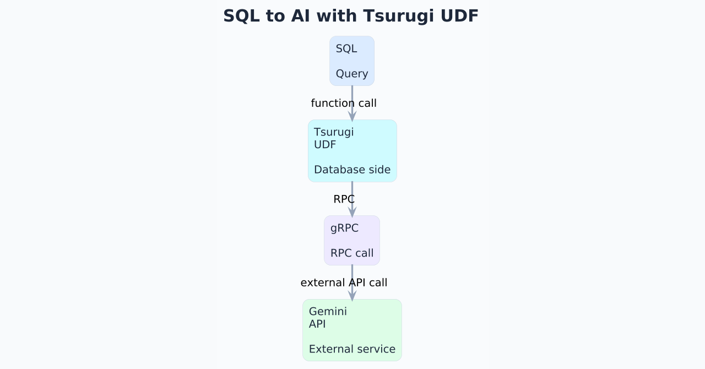
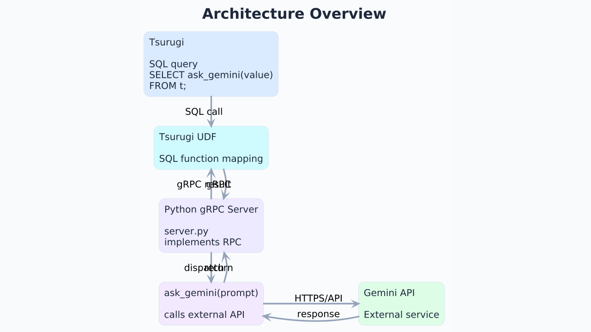
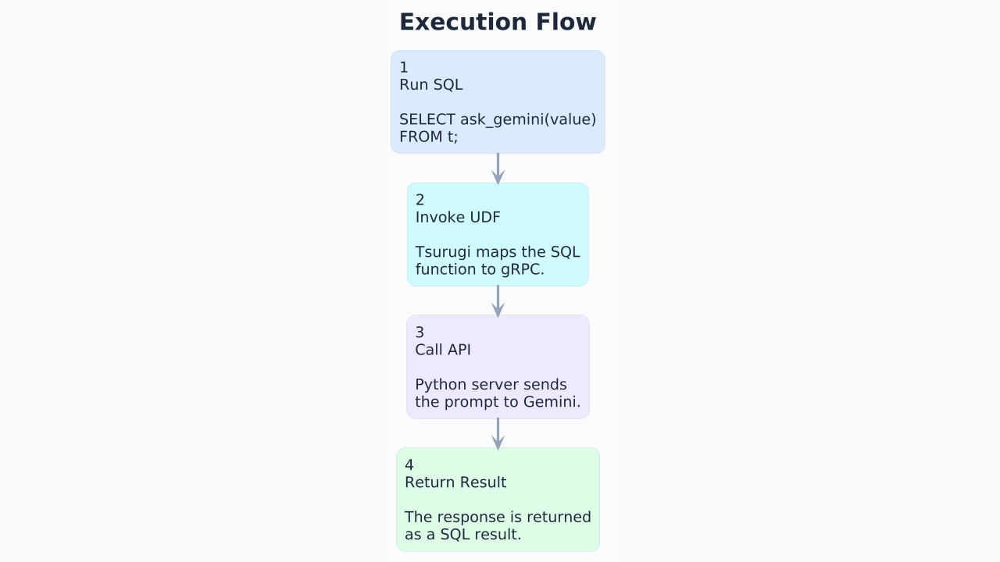
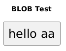

# Tsurugi UDFでAIを呼び出してみる：Gemini API、BLOB、streaming RPCの実装例



## はじめに

Tsurugi UDFについては、以前の記事「[【次世代高速RDB 劔“Tsurugi”】Tsurugi UDFを利用してリモート環境のAI処理をSQL一本で実行する](https://note.com/n_technologies/n/nf104efd29b47)」で詳しく紹介されています。

今回はその続編として、より小さなサンプルから始めます。
扱う内容は次の3つです。

- Tsurugi UDFを使ってSQLから簡単なGemini APIを呼び出す
- Gemini APIのマルチモーダル機能を試すため、画像から文字列を読み取る
- Tsurugi UDFで利用できる`optional`、`oneof`、Server streaming RPCsの例を紹介する

この記事の目的は、Tsurugi UDFを「AIを呼び出すための特別な仕組み」として説明することではありません。むしろ、Tsurugi UDFの本質である「SQLから外部プログラムを関数のように呼び出せる」という点を、Gemini連携という身近な例で確認することにあります。

## Tsurugi UDFとは

Tsurugi UDFは、外部で作成したプログラムをTsurugiのSQL関数として呼び出すための仕組みです。

たとえば、PythonやJava、C++などで実装した処理をgRPCサービスとして用意し、それをTsurugi側からSQL関数のように実行できます。

構成を簡略化すると、次のようになります。

```text
SQL
  ↓
Tsurugi UDF
  ↓
gRPC
  ↓
外部プログラム（Pythonなど）
  ↓
外部API（Gemini APIなど）
```



ここで重要なのは、Tsurugiが直接AIモデルを内蔵するわけではない、という点です。Tsurugi UDFを通じて外部プログラムを呼び出し、その外部プログラムがGemini APIなどの外部サービスと通信します。

この分離により、データベース側とAI処理側を独立して設計しやすくなります。

Tsurugi UDFの基本的な考え方や、シンプルな`SayHello`関数の作り方については、[Tsurugi UDF 概要](https://github.com/project-tsurugi/tsurugi-udf/blob/master/docs/udf-overview_ja.md)も参照してください。

## 動作環境

本記事では、次のバージョン以降を想定しています。

- [Tsurugi](https://github.com/project-tsurugi/tsurugidb) 1.11.0 以上
- [tsurugi-udf](https://github.com/project-tsurugi/tsurugi-udf) 0.4.0 以上
- Python 3.10 以上
- PlantUML
- Java / Gradle

また、Gemini APIを利用するため、[Google AI Studio](https://aistudio.google.com/)で取得したAPIキーが必要です。

> 本記事のコードは学習用の最小構成です。実運用で利用する場合は、APIキー管理、ネットワーク制御、ログ設計、入力データの取り扱い、レート制限、費用管理、エラーハンドリングなどを別途検討してください。

Python側では、次のパッケージを利用します。

```bash
python3 -m pip install google-genai grpcio grpcio-tools
```

画像生成のサンプルでは、PlantUMLをコマンドラインから呼び出しています。

Ubuntu環境では、たとえば次のようにインストールできます。

```bash
sudo apt update
sudo apt install plantuml graphviz
```

インストール後、次のコマンドで確認します。

```bash
plantuml -version
```

## 簡単なGemini API

### まずはPython関数としてGeminiを呼び出す

最初に、Tsurugiとは切り離して、PythonからGemini APIを呼び出す最小の関数を作ります。

APIキーはGoogle AI Studioで取得し、環境変数`GEMINI_API_KEY`に設定しておきます。

```python
import os
from google import genai


client = genai.Client(api_key=os.environ["GEMINI_API_KEY"])


def ask_gemini(prompt: str) -> str:
    response = client.models.generate_content(
        model="gemini-2.5-flash-lite",
        contents=prompt,
    )
    return response.text or ""


if __name__ == "__main__":
    print(ask_gemini("タイの首都は？"))
```

実行すると、たとえば次のような文字列が返ります。

```text
タイの首都はバンコクです。
```

この段階では、単にPython関数が外部APIを呼び出しているだけです。

次に、この関数をgRPCサービスとして公開し、Tsurugi UDFから呼び出せる形にします。

### Tsurugi UDF向けにprotoを定義する

Tsurugi UDFから呼び出すために、gRPCのインターフェースをProtocol Buffersで定義します。

ここでは、入力も出力も文字列にする最小構成にします。

`proto/gemini.proto`

```proto
syntax = "proto3";

message gemini_string {
  string str_value = 1;
}

service gemini_service {
  rpc ask_gemini(gemini_string) returns (gemini_string);
}
```

この定義により、`gemini_string`を受け取り、`gemini_string`を返す`ask_gemini`というRPCを定義できます。

SQL側から見ると、文字列を渡して文字列を受け取る関数として扱えるようになります。

### gRPCサーバーを実装する

次に、先ほどの`ask_gemini`関数をgRPCサーバーに組み込みます。

`server.py`

```python
from concurrent import futures
import logging
import os
import sys
from pathlib import Path

import grpc
from google import genai

PROTO_DIR = Path(__file__).resolve().parent / "proto"
sys.path.insert(0, str(PROTO_DIR))

import gemini_pb2
import gemini_pb2_grpc


client = genai.Client(api_key=os.environ["GEMINI_API_KEY"])


def ask_gemini(prompt: str) -> str:
    response = client.models.generate_content(
        model=os.getenv("GEMINI_MODEL", "gemini-2.5-flash-lite"),
        contents=prompt,
    )
    return response.text or ""


class GeminiService(gemini_pb2_grpc.gemini_serviceServicer):
    def ask_gemini(self, request, context):
        try:
            answer = ask_gemini(request.str_value)
            return gemini_pb2.gemini_string(str_value=answer)
        except Exception as e:
            logging.exception("ask_gemini failed")
            context.set_code(grpc.StatusCode.INTERNAL)
            context.set_details(str(e))
            return gemini_pb2.gemini_string(str_value="")


def serve():
    port = os.getenv("PORT", "40010")

    server = grpc.server(futures.ThreadPoolExecutor(max_workers=10))
    gemini_pb2_grpc.add_gemini_serviceServicer_to_server(
        GeminiService(),
        server,
    )

    server.add_insecure_port("[::]:" + port)
    server.start()

    print(f"Gemini gRPC server started, listening on {port}")
    server.wait_for_termination()


if __name__ == "__main__":
    logging.basicConfig(level=logging.INFO)
    serve()
```

このサーバーは、gRPCで受け取った文字列をGemini APIに渡し、その応答を文字列として返します。

### gRPC用のPythonファイルを生成する

`gemini_pb2.py`と`gemini_pb2_grpc.py`を生成します。

```bash
#!/bin/bash

PROTO_FILE="gemini.proto"

python3 -m grpc_tools.protoc \
  -Iproto \
  --python_out=proto \
  --grpc_python_out=proto \
  proto/${PROTO_FILE}
```

これで、PythonのgRPCサーバーから`gemini.proto`の定義を利用できるようになります。

### Tsurugi UDF用の.soを生成する

次に、`udf-plugin-builder`を使って、Tsurugiから呼び出すためのプラグインを生成します。

```bash
#!/bin/bash

PROTO_FILE="gemini.proto"

udf-plugin-builder --proto proto/${PROTO_FILE} \
  -I proto \
  --grpc-endpoint "dns:///localhost:40010" \
  --output-dir ${BASE_DIR}
```

`BASE_DIR`には、`tsurugi.ini`で指定している`plugin_directory`のパスを指定します。

この設定により、Tsurugi側のUDF呼び出しが、`localhost:40010`で起動しているgRPCサーバーに転送されます。

### SQLからGeminiを呼び出す

必要なファイルを生成し、Tsurugiと`server.py`を起動したうえで、次のSQLを実行します。

```sql
SELECT ask_gemini('タイの首都は？');
```

結果として、Gemini APIの応答がSQLの実行結果として返ります。

```text
{"@#0":"タイの首都はバンコクです。"}
```

ここまでで、SQLから外部のAI APIを呼び出し、その結果をSQL上で扱う流れを確認できました。



## 画像から文字列を読み取る

まずは、Geminiに画像を渡して、画像内の文字列を読み取るPythonプログラムを確認します。

[PlantUML](https://plantuml.com/)で画像をつくってそのバイト列をGeminiに渡すサンプルです。

```python
import os
import subprocess
from google import genai
from google.genai import types


client = genai.Client(api_key=os.environ["GEMINI_API_KEY"])


def escape_plantuml_text(text: str) -> str:
    return text.replace("\\", "\\\\").replace('"', '\\"')


def make_plantuml_png_blob(text: str) -> bytes:
    safe_text = escape_plantuml_text(text)

    puml = f"""@startuml
skinparam backgroundColor #FFFFFF
skinparam defaultFontName SansSerif
skinparam defaultFontSize 24
title OCR Test

rectangle "{safe_text}" as Target

@enduml
"""

    result = subprocess.run(
        ["plantuml", "-tpng", "-pipe"],
        input=puml.encode("utf-8"),
        stdout=subprocess.PIPE,
        stderr=subprocess.PIPE,
        check=True,
    )

    return result.stdout


def read_text_from_image_blob(image_bytes: bytes, mime_type: str = "image/png") -> str:
    response = client.models.generate_content(
        model="gemini-2.5-flash-lite",
        contents=[
            "この画像に書かれている文字を、できるだけ正確に読み取ってください。",
            types.Part.from_bytes(
                data=image_bytes,
                mime_type=mime_type,
            ),
        ],
    )
    return response.text or ""


if __name__ == "__main__":
    image_blob = make_plantuml_png_blob("Tsurugi UDF calls Gemini API")

    result = read_text_from_image_blob(image_blob)

    print(result)

```



### BLOBで画像を渡す

ここまでの例では、SQLから文字列を渡して文字列を受け取りました。

次に、画像データを扱います。

画像のようなバイナリデータをUDFに渡す場合、SQL文字列に変換して渡すのではなく、BLOBとして扱うのが自然です。Tsurugi UDFでは、BLOBの実体を直接メッセージに埋め込むのではなく、`BlobReference`としてgRPCサーバーに渡し、サーバー側で必要に応じて実体を取得します。

ここでは、次の流れで画像OCRのサンプルを作ります。

```text
PlantUMLでPNGを生成
  ↓
IceaxeでTsurugiのBLOB列にINSERT
  ↓
SQLからask_gemini_with_blob(blob1)を呼び出す
  ↓
Python gRPCサーバーがBLOBを取得
  ↓
Gemini APIに画像として渡す
  ↓
読み取った文字列をSQLの結果として返す
```

BLOBでの画像利用については、前回の記事でも紹介されています。

ここでは、[Iceaxe](https://github.com/project-tsurugi/iceaxe)を使って画像データをTsurugiにINSERTするプログラムを紹介します。ビルドにはGradleを利用する想定です。

サンプルコードは以下のリポジトリに置いています。

https://github.com/YoshiakiNishimura/udf_gemini_gradle

```java
import com.tsurugidb.iceaxe.TsurugiConnector;
import com.tsurugidb.iceaxe.metadata.TgTableMetadata;
import com.tsurugidb.iceaxe.session.TsurugiSession;
import com.tsurugidb.iceaxe.sql.TsurugiSqlPreparedStatement;
import com.tsurugidb.iceaxe.sql.parameter.TgBindParameters;
import com.tsurugidb.iceaxe.sql.parameter.TgBindVariables;
import com.tsurugidb.iceaxe.sql.parameter.TgParameterMapping;
import com.tsurugidb.iceaxe.sql.result.TsurugiStatementResult;
import com.tsurugidb.iceaxe.sql.type.TgBlob;
import com.tsurugidb.iceaxe.transaction.TsurugiTransaction;
import com.tsurugidb.iceaxe.transaction.exception.TsurugiTransactionException;
import com.tsurugidb.iceaxe.transaction.function.TsurugiTransactionTask;
import com.tsurugidb.iceaxe.transaction.manager.TgTmSetting;
import com.tsurugidb.iceaxe.transaction.manager.TsurugiTransactionManager;
import com.tsurugidb.iceaxe.transaction.option.TgTxOption;
import java.io.IOException;
import java.net.URI;
import java.nio.file.Files;
import java.nio.file.Path;
import java.util.Optional;

public class HelloWorld {
    private static final String TABLE_NAME = "b";

    public static void main(String[] args) throws IOException, InterruptedException {
        URI endpoint = URI.create(args.length >= 1 ? args[0] : "ipc:tsurugi");
        Path pngPath = Path.of(args.length >= 2 ? args[1] : "aa.png").toAbsolutePath().normalize();

        if (!Files.exists(pngPath)) {
            throw new IOException("PNG file not found: " + pngPath.toAbsolutePath());
        }

        System.out.println("endpoint = " + endpoint);
        System.out.println("pngPath  = " + pngPath.toAbsolutePath());

        TsurugiConnector connector = TsurugiConnector.of(endpoint);
        try (TsurugiSession session = connector.createSession()) {
            executeCreateTable(session);
            executeInsertBlob(session, pngPath);
        }

        System.out.println("inserted PNG BLOB");
    }

    private static void executeCreateTable(TsurugiSession session)
        throws IOException, InterruptedException {
        TgTmSetting setting = TgTmSetting.of(TgTxOption.ofDDL());
        TsurugiTransactionManager tm = session.createTransactionManager(setting);

        Optional<TgTableMetadata> metadata = session.findTableMetadata(TABLE_NAME);
        if (metadata.isPresent()) { tm.executeDdl("drop table " + TABLE_NAME); }

        String sql = """
        create table b (
            blob1 blob
        )
        """;

        tm.executeDdl(sql);
    }

    private static void executeInsertBlob(TsurugiSession session, Path pngPath)
        throws IOException, InterruptedException {
        TgTmSetting setting = TgTmSetting.ofAlways(TgTxOption.ofLTX(TABLE_NAME));
        TsurugiTransactionManager tm = session.createTransactionManager(setting);

        String sql = "insert into b(blob1) values (:blob1)";

        var variables = TgBindVariables.of().addBlob("blob1");

        var parameterMapping = TgParameterMapping.of(variables);

        try (TsurugiSqlPreparedStatement<TgBindParameters> ps =
                 session.createStatement(sql, parameterMapping)) {
            tm.execute(new TsurugiTransactionTask<Integer>() {
                @Override
                public Integer run(TsurugiTransaction transaction)
                    throws IOException, InterruptedException, TsurugiTransactionException {
                    TgBlob blob = TgBlob.of(pngPath);

                    var parameter = TgBindParameters.of().addBlob("blob1", blob);

                    try (TsurugiStatementResult result =
                             transaction.executeStatement(ps, parameter)) {
                        return result.getUpdateCount();
                    }
                }
            });
        }
    }
}
```

参照する画像を生成するプログラムは以下の通りです。

```python
import argparse
import hashlib
import subprocess
from pathlib import Path


def escape_plantuml_text(text: str) -> str:
    return text.replace("\\", "\\\\").replace('"', '\\"')


def sha256_hex(data: bytes) -> str:
    return hashlib.sha256(data).hexdigest()


def ensure_png_suffix(path: Path) -> Path:
    if path.suffix.lower() != ".png":
        return path.with_suffix(".png")
    return path


def make_plantuml_png_blob(text: str) -> bytes:
    safe_text = escape_plantuml_text(text)

    puml = f"""@startuml
skinparam backgroundColor #FFFFFF
skinparam defaultFontName SansSerif
skinparam defaultFontSize 24
title BLOB Test

rectangle "{safe_text}" as Target

@enduml
"""

    result = subprocess.run(
        ["plantuml", "-tpng", "-pipe"],
        input=puml.encode("utf-8"),
        stdout=subprocess.PIPE,
        stderr=subprocess.PIPE,
        check=True,
    )

    return result.stdout


def make_png_file(output_path: str) -> None:
    path = ensure_png_suffix(Path(output_path))

    base_text = path.stem
    ocr_text = f"hello {base_text}"

    png_bytes = make_plantuml_png_blob(ocr_text)

    path.write_bytes(png_bytes)

    print("png file =", path)
    print("ocr text =", ocr_text)
    print("size     =", len(png_bytes))
    print("sha256   =", sha256_hex(png_bytes))
    print("header   =", png_bytes[:16])
    print("is png   =", png_bytes.startswith(b"\x89PNG\r\n\x1a\n"))


def main() -> None:
    parser = argparse.ArgumentParser(
        description="Create a PlantUML PNG file for OCR/BLOB testing."
    )
    parser.add_argument(
        "output_path",
        help="Output PNG filename. If .png is omitted, it is added automatically.",
    )

    args = parser.parse_args()
    make_png_file(args.output_path)


if __name__ == "__main__":
    main()
```

### 変更ファイル

#### proto

```proto
syntax = "proto3";
import "tsurugidb/udf/tsurugi_types.proto";

message gemini_string {
  string str_value = 1;
}
message gemini_string_blob {
  tsurugidb.udf.BlobReference blob_value = 1;
}
service gemini_service {
  rpc ask_gemini(gemini_string) returns (gemini_string);
  rpc ask_gemini_with_blob(gemini_string_blob) returns (gemini_string);
}
```

注: `python3 -m grpc_tools.protoc` と `udf-plugin-builder` の `-I` パスには、`tsurugi_types.proto` があるディレクトリを指定してください。

```
cd /home/sample
git clone https://github.com/project-tsurugi/tsurugi-udf

の場合 -I/home/sample/tsurugi-udf/proto
```

#### server

```python
from concurrent import futures
import logging
import os
import sys
from pathlib import Path
import tempfile
from datetime import timedelta
import hashlib
from tsurugidb.udf import create_blob_client

import grpc
from google import genai
from google.genai import types

PROTO_DIR = Path(__file__).resolve().parent / "proto"
sys.path.insert(0, str(PROTO_DIR))

import gemini_pb2
import gemini_pb2_grpc

client = genai.Client(api_key=os.environ["GEMINI_API_KEY"])

def sha256_hex(data: bytes) -> str:
    return hashlib.sha256(data).hexdigest()

def blob_ref_to_bytes(blob_ref, context) -> bytes:
    with create_blob_client(context) as blob_client:
        with tempfile.TemporaryDirectory() as tmpdir:
            path = Path(tmpdir) / "input.png"

            blob_client.download_blob(
                blob_ref,
                path,
                timeout=timedelta(seconds=60),
            )

            return path.read_bytes()


def assert_png(data: bytes) -> None:
    if not data.startswith(b"\x89PNG\r\n\x1a\n"):
        raise ValueError("BLOB data is not PNG")

def ask_gemini(prompt: str) -> str:
    response = client.models.generate_content(
        model=os.getenv("GEMINI_MODEL", "gemini-2.5-flash-lite"),
        contents=prompt,
    )
    return response.text or ""

def read_text_from_image_blob(image_bytes: bytes, mime_type: str = "image/png") -> str:
    response = client.models.generate_content(
        model="gemini-2.5-flash-lite",
        contents=[
            "この画像に書かれている文字を、できるだけ正確に読み取ってください。",
            types.Part.from_bytes(
                data=image_bytes,
                mime_type=mime_type,
            ),
        ],
    )
    return response.text or ""

class GeminiService(gemini_pb2_grpc.gemini_serviceServicer):
    def ask_gemini(self, request, context):
        try:
            answer = ask_gemini(request.str_value)
            return gemini_pb2.gemini_string(str_value=answer)

        except Exception as e:
            logging.exception("ask_gemini failed")
            context.set_code(grpc.StatusCode.INTERNAL)
            context.set_details(str(e))
            return gemini_pb2.gemini_string(str_value="")
    def ask_gemini_with_blob(self, request, context):
        try:
            logging.info("ask_gemini_with_blob called")

            if not request.HasField("blob_value"):
                raise ValueError("blob_value is NULL")

            blob = request.blob_value
            logging.info(
                "blob_value: storage_id=%s object_id=%s tag=%s provisioned=%s",
                blob.storage_id,
                blob.object_id,
                blob.tag,
                blob.provisioned,
            )

            image_bytes = blob_ref_to_bytes(request.blob_value, context)
            assert_png(image_bytes)

            logging.info("png size=%d", len(image_bytes))
            logging.info("png sha256=%s", sha256_hex(image_bytes))
            logging.info("png header=%r", image_bytes[:16])

            answer = read_text_from_image_blob(
                image_bytes,
                mime_type="image/png",
            )

            return gemini_pb2.gemini_string(str_value=answer)

        except Exception as e:
            logging.exception("ask_gemini_with_blob failed")
            context.set_code(grpc.StatusCode.INTERNAL)
            context.set_details(str(e))
            return gemini_pb2.gemini_string(str_value="")

def serve():
    port = os.getenv("PORT", "40010")

    server = grpc.server(futures.ThreadPoolExecutor(max_workers=10))
    gemini_pb2_grpc.add_gemini_serviceServicer_to_server(
        GeminiService(),
        server,
    )

    server.add_insecure_port("[::]:" + port)
    server.start()

    print(f"Gemini gRPC server started, listening on {port}")
    server.wait_for_termination()


if __name__ == "__main__":
    logging.basicConfig(level=logging.INFO)
    serve()

```

### 結果

```
select ask_gemini_with_blob(blob1) from b;

{"@#0":"画像に書かれている文字は以下の通りです。\n\n**BLOB Test**\n**hello aa**"}
```

## proto定義で表現の幅を広げる

ここまでのサンプルでは、Gemini APIを呼び出す処理を題材にしました。

ここからは少し視点を変えて、Tsurugi UDFでgRPC/Protocol Buffersを使うときに便利な定義方法を見ていきます。

Tsurugi UDFでは、gRPC/Protocol Buffersのすべての機能をそのままSQL関数として扱えるわけではありませんが、UDFの入力や戻り値を表現するうえで便利な記述方法があります。

ここでは、次の3つを簡単に紹介します。

- `optional`
- `oneof`
- Server streaming RPCs

参考資料として、Protocol BuffersとgRPCの公式ドキュメントもあわせて参照してください。

- [Language Guide (proto 3)](https://protobuf.dev/programming-guides/proto3/)
- [Core concepts, architecture and lifecycle](https://grpc.io/docs/what-is-grpc/core-concepts/)

### optional：NULLを扱う

SQLではNULLを扱う場面があります。

proto側で`optional`を使うと、値が存在しない可能性を表現できます。

NULLを入力または出力として扱う可能性がある場合は、`optional`の利用を検討してください。

#### proto例

```proto
syntax = "proto3";

message hello_string_optional {
  optional string str_value = 1;
}
service gemini_service {
  rpc ask_hello_optional(hello_string_optional) returns (hello_string_optional);
}
```

#### server例

```python
    def ask_hello_optional(self, request, context):
        try:
            logging.info("ask_hello_optional called")

            if request.HasField("str_value"):
                logging.info("str_value=%r", request.str_value)
                value = request.str_value
                return udf_doc_sample_pb2.hello_string_optional(
                    str_value=f"hello {value}"
                )

            logging.info("str_value is NULL")
            return udf_doc_sample_pb2.hello_string_optional()

        except Exception as e:
            logging.exception("ask_hello_optional failed")
            context.set_code(grpc.StatusCode.INTERNAL)
            context.set_details(str(e))
            return udf_doc_sample_pb2.hello_string_optional()
```

#### 結果

##### `optional`指定あり

```text
// {"columns":[{"name":null,"label":"@#0","type":"CHARACTER","dimension":0}]}
{"@#0":null}
```

##### `optional`指定なし

```text
// {"columns":[{"name":null,"label":"@#0","type":"CHARACTER","dimension":0}]}[main] ERROR com.tsurugidb.tgsql.core.executor.report.BasicReporter - VALUE_EVALUATION_EXCEPTION (SQL-02011: an error (unknown) occurred:[diagnostic(code=invalid_input_value, message='ask_hello : argument #1 must not be NULL')])
```

### oneof：複数の型候補を扱う

`oneof`を使うと、複数の型候補のうち、どれか1つを持つデータ構造を表現できます。

文字列だけでなく、数値など複数の入力型を扱いたい場合に利用できます。

#### proto例

```proto
syntax = "proto3";

message hello_string {
  string str_value = 1;
}
message hello_string_oneof {
  oneof f1 {
    string str_value = 1;
    int64 f1_int64 = 2;
  }
}
service gemini_service {
  rpc ask_hello_oneof(hello_string_oneof) returns (hello_string);
}
```

#### server例

```python
    def ask_hello_oneof(self, request, context):
        try:
            logging.info("ask_hello_oneof called")

            field = request.WhichOneof("f1")
            logging.info("oneof f1 field=%r", field)

            if field == "str_value":
                logging.info("str_value=%r", request.str_value)
                answer = f"hello {request.str_value}"

            elif field == "f1_int64":
                logging.info("f1_int64=%r", request.f1_int64)
                answer = f"hello {request.f1_int64}"

            else:
                logging.info("oneof f1 is not set")
                answer = "hello"

            return udf_doc_sample_pb2.hello_string(
                str_value=answer
            )

        except Exception as e:
            logging.exception("ask_hello_oneof failed")
            context.set_code(grpc.StatusCode.INTERNAL)
            context.set_details(str(e))
            return udf_doc_sample_pb2.hello_string(str_value="")
```

### Server streaming RPCs：複数行の結果を返す

Server streaming RPCsを使うと、1回の呼び出しに対して複数の結果を返す形にできます。

#### proto例

```proto
syntax = "proto3";

message hello_string {
  string str_value = 1;
}
service gemini_service {
  rpc ask_hello_stream(hello_string) returns (stream hello_string);
}

```

#### server例

```python
    def ask_hello_stream(self, request, context):
        try:
            logging.info("ask_hello_stream called")
            logging.info("str_value=%r", request.str_value)

            value = request.str_value

            yield udf_doc_sample_pb2.hello_string(str_value=f"hello {value}")
            yield udf_doc_sample_pb2.hello_string(str_value=f"hello hello {value}")
            yield udf_doc_sample_pb2.hello_string(str_value=f"bye {value}")

        except Exception as e:
            logging.exception("ask_hello_stream failed")
            context.set_code(grpc.StatusCode.INTERNAL)
            context.set_details(str(e))
            return
```

#### 結果

SQL側では、たとえば`CROSS APPLY`を使って、UDFの戻り値を表として扱えます。

```sql
SELECT R.value
FROM z1
CROSS APPLY ask_hello_stream(
  z1.string_value
) AS R(value);
```

`CROSS APPLY`は、左側の各行を入力として右側の関数を呼び出し、その戻り値を表として結合する構文です。

これにより、UDFの処理結果を単一の値としてだけでなく、行の集合としてSQL上で扱えるようになります。

```
// {"columns":[{"name":"value","label":"value","type":"CHARACTER","dimension":0}]}
{"value":"hello aaa"}
{"value":"hello hello aaa"}
{"value":"bye aaa"}
```

## まとめ

この記事では、Tsurugi UDFを使ってSQLからGemini APIを呼び出すサンプルを紹介しました。

最初に、文字列を入力して文字列を返す最小構成のUDFを作りました。次に、BLOBとして登録したPNG画像をPython gRPCサーバー側で取得し、Gemini APIに画像として渡す例を確認しました。最後に、`optional`、`oneof`、Server streaming RPCsを使って、NULL、複数型の入力、複数行の戻り値を扱う方法を紹介しました。

ポイントは次の通りです。

- Tsurugi UDFは、外部プログラムをSQL関数のように呼び出す仕組みである
- Pythonなどで実装したgRPCサービスを、SQLから呼び出せる
- Gemini APIのような外部APIも、gRPCサーバーを介せばSQLから利用できる
- BLOBを使うと、画像などのバイナリデータをUDFの入力として扱える
- `optional`、`oneof`、Server streaming RPCsを使うと、UDFの入力や戻り値の表現を広げられる

Tsurugi UDFの面白さは、データベースの外にある処理をSQLの世界に自然に接続できる点にあります。

AI、画像処理、動画処理、既存システム連携など、外部プログラムとして実装できる処理であれば、Tsurugi UDFの活用範囲は大きく広がります。

まずは小さな関数から試してみると、Tsurugiと外部処理を組み合わせる感覚をつかみやすいと思います。
