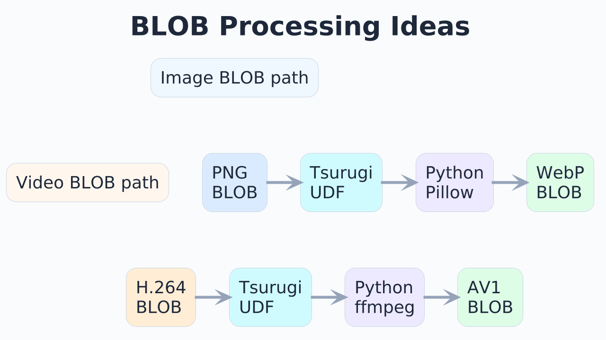

# Tsurugi UDFでAIを使ってみる：Gemini連携のシンプルな実装例


## 動作環境

本記事では、次のバージョン以降を想定しています。

- [Tsurugi](https://github.com/project-tsurugi/tsurugidb) 1.11.0 以上
- [tsurugi-udf](https://github.com/project-tsurugi/tsurugi-udf) 0.4.0 以上

また、Gemini APIを利用するため、[Google AI Studio](https://aistudio.google.com/)で取得したAPIキーが必要です。

> 本記事のコードは学習用の最小構成です。実運用で利用する場合は、APIキー管理、ネットワーク制御、ログ設計、入力データの取り扱い、レート制限、費用管理、エラーハンドリングなどを別途検討してください。

## はじめに

Tsurugi UDFについては、以前の記事「[【次世代高速RDB 劔“Tsurugi”】Tsurugi UDFを利用してリモート環境のAI処理をSQL一本で実行する](https://note.com/n_technologies/n/nf104efd29b47)」で詳しく紹介されています。

今回はその続編として、より小さなサンプルから始めます。題材は、Tsurugi UDFを使ってSQLからGemini APIを呼び出す例です。

この記事の目的は、Tsurugi UDFを「AIを呼び出すための特別な仕組み」として説明することではありません。むしろ、Tsurugi UDFの本質である「SQLから外部プログラムを関数のように呼び出せる」という点を、Gemini連携という身近な例で確認することにあります。

## Tsurugi UDFとは

Tsurugi UDFは、外部で作成したプログラムをTsurugiのSQL関数として呼び出すための仕組みです。

たとえば、PythonやJava、C++などで実装した処理をgRPCサービスとして用意し、それをTsurugi側からSQL関数のように実行できます。

構成を簡略化すると、次のようになります。

```text
SQL
  ↓
Tsurugi UDF
  ↓
gRPC
  ↓
外部プログラム（Pythonなど）
  ↓
外部API（Gemini APIなど）
```


ここで重要なのは、Tsurugiが直接AIモデルを内蔵するわけではない、という点です。Tsurugi UDFを通じて外部プログラムを呼び出し、その外部プログラムがGemini APIなどの外部サービスと通信します。

この分離により、データベース側とAI処理側を独立して設計しやすくなります。

Tsurugi UDFの基本的な考え方や、シンプルな`SayHello`関数の作り方については、[Tsurugi UDF 概要](https://github.com/project-tsurugi/tsurugi-udf/blob/master/docs/udf-overview_ja.md)も参照してください。

## まずはPython関数としてGeminiを呼び出す

最初に、Tsurugiとは切り離して、PythonからGemini APIを呼び出す最小の関数を作ります。

APIキーはGoogle AI Studioで取得し、環境変数`GEMINI_API_KEY`に設定しておきます。

```python
import os
from google import genai


client = genai.Client(api_key=os.environ["GEMINI_API_KEY"])


def ask_gemini(prompt: str) -> str:
    response = client.models.generate_content(
        model="gemini-2.5-flash-lite",
        contents=prompt,
    )
    return response.text or ""


if __name__ == "__main__":
    print(ask_gemini("タイの首都は？"))
```

実行すると、たとえば次のような文字列が返ります。

```text
タイの首都はバンコクです。
```

この段階では、単にPython関数が外部APIを呼び出しているだけです。

次に、この関数をgRPCサービスとして公開し、Tsurugi UDFから呼び出せる形にします。

## Tsurugi UDF向けにprotoを定義する

Tsurugi UDFから呼び出すために、gRPCのインターフェースをProtocol Buffersで定義します。

ここでは、入力も出力も文字列にする最小構成にします。

`proto/gemini.proto`

```proto
syntax = "proto3";

message gemini_string {
  string str_value = 1;
}

service gemini_service {
  rpc ask_gemini(gemini_string) returns (gemini_string);
}
```

この定義により、`gemini_string`を受け取り、`gemini_string`を返す`ask_gemini`というRPCを定義できます。

SQL側から見ると、文字列を渡して文字列を受け取る関数として扱えるようになります。

## gRPCサーバーを実装する

次に、先ほどの`ask_gemini`関数をgRPCサーバーに組み込みます。

`server.py`

```python
from concurrent import futures
import logging
import os
import sys
from pathlib import Path

import grpc
from google import genai

PROTO_DIR = Path(__file__).resolve().parent / "proto"
sys.path.insert(0, str(PROTO_DIR))

import gemini_pb2
import gemini_pb2_grpc


client = genai.Client(api_key=os.environ["GEMINI_API_KEY"])


def ask_gemini(prompt: str) -> str:
    response = client.models.generate_content(
        model=os.getenv("GEMINI_MODEL", "gemini-2.5-flash-lite"),
        contents=prompt,
    )
    return response.text or ""


class GeminiService(gemini_pb2_grpc.gemini_serviceServicer):
    def ask_gemini(self, request, context):
        try:
            answer = ask_gemini(request.str_value)
            return gemini_pb2.gemini_string(str_value=answer)
        except Exception as e:
            logging.exception("ask_gemini failed")
            context.set_code(grpc.StatusCode.INTERNAL)
            context.set_details(str(e))
            return gemini_pb2.gemini_string(str_value="")


def serve():
    port = os.getenv("PORT", "40010")

    server = grpc.server(futures.ThreadPoolExecutor(max_workers=10))
    gemini_pb2_grpc.add_gemini_serviceServicer_to_server(
        GeminiService(),
        server,
    )

    server.add_insecure_port("[::]:" + port)
    server.start()

    print(f"Gemini gRPC server started, listening on {port}")
    server.wait_for_termination()


if __name__ == "__main__":
    logging.basicConfig(level=logging.INFO)
    serve()
```

このサーバーは、gRPCで受け取った文字列をGemini APIに渡し、その応答を文字列として返します。

## gRPC用のPythonファイルを生成する

`gemini_pb2.py`と`gemini_pb2_grpc.py`を生成します。

```bash
#!/bin/bash

PROTO_FILE="gemini.proto"

python3 -m grpc_tools.protoc \
  -Iproto \
  --python_out=proto \
  --grpc_python_out=proto \
  proto/${PROTO_FILE}
```

これで、PythonのgRPCサーバーから`gemini.proto`の定義を利用できるようになります。

## Tsurugi UDF用の.soを生成する

次に、`udf-plugin-builder`を使って、Tsurugiから呼び出すためのプラグインを生成します。

```bash
#!/bin/bash

PROTO_FILE="gemini.proto"

udf-plugin-builder --proto proto/${PROTO_FILE} \
  -I proto \
  --grpc-endpoint "dns:///localhost:40010" \
  --output-dir ${BASE_DIR}
```

`BASE_DIR`には、`tsurugi.ini`で指定している`plugin_directory`のパスを指定します。

この設定により、Tsurugi側のUDF呼び出しが、`localhost:40010`で起動しているgRPCサーバーに転送されます。

## SQLからGeminiを呼び出す

必要なファイルを生成し、Tsurugiと`server.py`を起動したうえで、次のSQLを実行します。

```sql
DROP TABLE IF EXISTS t;

CREATE TABLE t (
  string_value VARCHAR(255)
);

INSERT INTO t VALUES (
  'タイの首都は？'
);

SELECT ask_gemini(string_value) FROM t;
```

結果として、Gemini APIの応答がSQLの実行結果として返ります。

```json
{"@#0":"タイの首都はバンコクです。"}
```

ここまでで、SQLから外部のAI APIを呼び出し、その結果をSQL上で扱う流れを確認できました。


## proto定義で表現の幅を広げる

Tsurugi UDFでは、gRPC/Protocol Buffersのすべての機能をそのまま使えるわけではありませんが、UDFとして扱ううえで便利な記述方法があります。

ここでは、次の3つを簡単に紹介します。

- `optional`
- `oneof`
- Server streaming RPCs

参考資料として、Protocol BuffersとgRPCの公式ドキュメントもあわせて参照してください。

- [Language Guide (proto 3)](https://protobuf.dev/programming-guides/proto3/)
- [Core concepts, architecture and lifecycle](https://grpc.io/docs/what-is-grpc/core-concepts/)

### optional：NULLを扱う

SQLではNULLを扱う場面があります。

proto側で`optional`を使うと、値が存在しない可能性を表現できます。

```proto
syntax = "proto3";

message gemini_string {
  optional string str_value = 1;
}

service gemini_service {
  rpc ask_gemini(gemini_string) returns (gemini_string);
}
```

NULLを入力または出力として扱う可能性がある場合は、`optional`の利用を検討してください。

### oneof：複数の型候補を扱う

`oneof`を使うと、複数の型候補のうち、どれか1つを持つデータ構造を表現できます。

```proto
syntax = "proto3";

message gemini_string {
  optional string str_value = 1;
}

message gemini_multi {
  oneof f1 {
    int32 f1_int32 = 1;
    int64 f1_int64 = 2;
    float f1_float = 3;
    double f1_double = 4;
    string f1_string = 5;
  }
}

service gemini_service {
  rpc ask_gemini(gemini_multi) returns (gemini_string);
}
```

文字列だけでなく、数値など複数の入力型を扱いたい場合に利用できます。

### Server streaming RPCs：複数行の結果を返す

Server streaming RPCsを使うと、1回の呼び出しに対して複数の結果を返す形にできます。

```proto
syntax = "proto3";

message gemini_string {
  optional string str_value = 1;
}

service gemini_service {
  rpc ask_gemini(gemini_string) returns (stream gemini_string);
}
```

SQL側では、たとえば`CROSS APPLY`を使って、UDFの戻り値を表として扱えます。

```sql
DROP TABLE IF EXISTS t;

CREATE TABLE t (
  string_value VARCHAR(255)
);

INSERT INTO t VALUES (
  'タイの首都は？'
);

SELECT R.value
FROM t
CROSS APPLY ask_gemini(
  t.string_value
) AS R(value);
```

`CROSS APPLY`は、左側の各行を入力として右側の関数を呼び出し、その戻り値を表として結合する構文です。

これにより、UDFの処理結果を単一の値としてだけでなく、行の集合としてSQL上で扱えるようになります。

## BLOBを使った発展例

ここまでの例では、文字列を入力し、文字列を返しました。

一方、AI活用では画像や動画などのバイナリデータを扱いたい場面もあります。

たとえば、次のような処理が考えられます。

- 画像データを受け取り、別形式に変換する(PNGをWebPに変換する)
- 動画データを受け取り、別コーデックに変換する
- 生成AIの出力画像をBLOBとして扱う
- 複数のプロンプトとシード値をSQLで管理し、生成結果を比較する

このような場合、ファイルに一度書き出してから処理する方法もありますが、処理の流れによってはBLOBとして扱うことで、データベース上のデータと外部処理をより自然につなげられる可能性があります。

またTsurugiはインメモリDBですので、ファイルIOが発生するような低速処理を組み込むことは全体の高速性を著しく損ねますので、BLOBの利用を推奨します。



ただし、画像・動画処理ではデータサイズが大きくなりやすく、メモリ使用量、処理時間、並列実行数、タイムアウト、API利用料などの設計が重要になります。

まずは小さなデータと検証用の環境で動作を確認し、要件に応じて段階的に拡張するのがよいでしょう。

## まとめ

この記事では、Tsurugi UDFを使ってSQLからGemini APIを呼び出す最小構成を紹介しました。

ポイントは次の通りです。

- Tsurugi UDFは、外部プログラムをSQL関数のように呼び出す仕組みである
- gRPCサービスとして実装すれば、Pythonなどで書いた処理をSQLから利用できる
- Gemini APIを呼び出すPython関数も、gRPCサーバー化することでTsurugi UDFから呼び出せる
- `optional`、`oneof`、Server streaming RPCsを使うと、入力や戻り値の表現を広げられる
- BLOBを組み合わせると、画像・動画・生成AI処理などへの発展も考えられる

Tsurugi UDFの面白さは、データベースの外にある処理を、SQLの世界に自然に接続できる点にあります。

AI、画像処理、動画処理、既存システム連携など、外部プログラムとして実装できる処理であれば、Tsurugi UDFの活用範囲は大きく広がります。

まずは小さな関数から試してみて、Tsurugiと外部処理を組み合わせる感覚をつかんでみてください。

